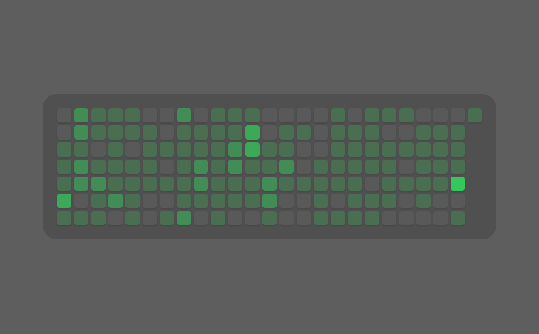

# GitHub Contributions

[](https://creativecommons.org/licenses/by-nc/4.0/)

A GitHub contributions widget for [Übersicht](http://tracesof.net/uebersicht/). It renders your public contribution calendar as a heatmap grid, in GitHub greens or a theme-aware monochrome scale. It reads the public contribution data from your GitHub profile page, so no API token is required. Colors are theme-aware, with sensible built-in defaults, so the widget works on its own.

## Setup

Set your GitHub username. Open `index.coffee` and change `GH_USER` on the first line of the `command`:

```coffeescript
command: "GH_USER='your-username'; curl -s ..."
```

## Options

At the top of `index.coffee`:

```coffeescript
  # Display mode: 'monochrome' (grey scale) or 'color' (GitHub greens).
  mode: 'color'

  # History span: 'year' (full ~53 weeks, 2-column / 650px wide) or '6mo'
  # (last ~26 weeks, 1-column / 320px wide).
  span: '6mo'
```

## Screenshot



## Installation

- Download the [repository](https://github.com/dionmunk/uebersicht-github-contributions/archive/master.zip) and extract it.
- Place the `github-contributions.widget` folder in your Übersicht extension folder.
- Set your `GH_USER` (see Setup above).
- Refresh Übersicht.

## Theming

This widget is theme-aware. Its colors come from CSS custom properties (text, panel tint, status and series colors) with sensible built-in fallbacks, so it looks right on its own. Install the [Theme Controller](https://github.com/dionmunk/uebersicht-theme-controller) widget and this one automatically follows its color scheme and light/dark mode, staying in sync with the rest of the collection.

## License

This work is licensed under a [Creative Commons Attribution-NonCommercial 4.0 International License](https://creativecommons.org/licenses/by-nc/4.0/).
